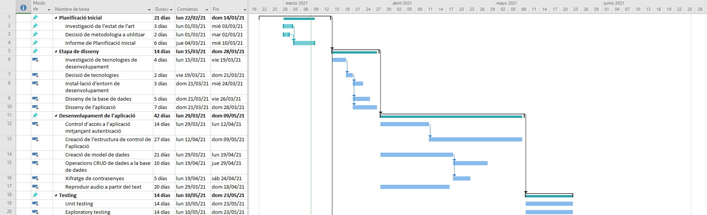
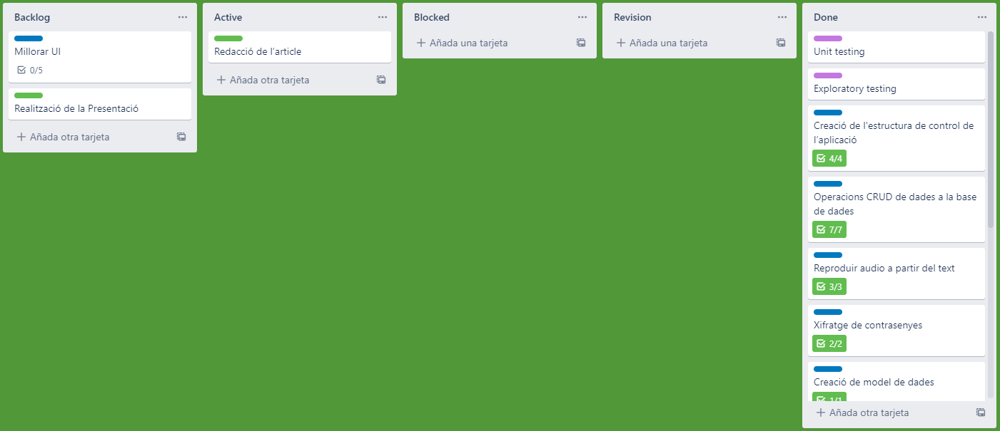
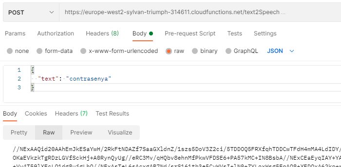
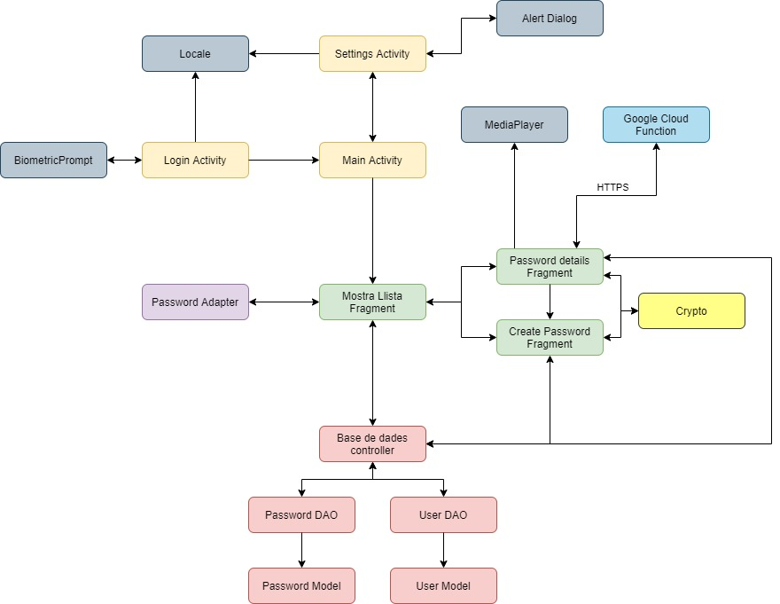
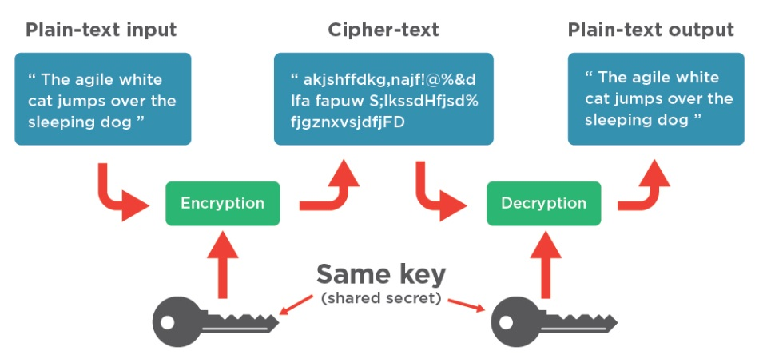
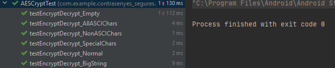
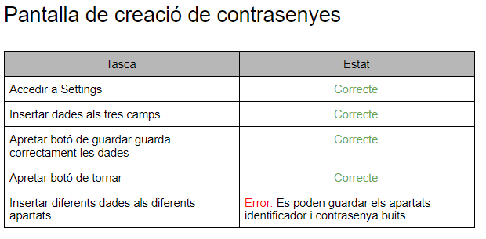
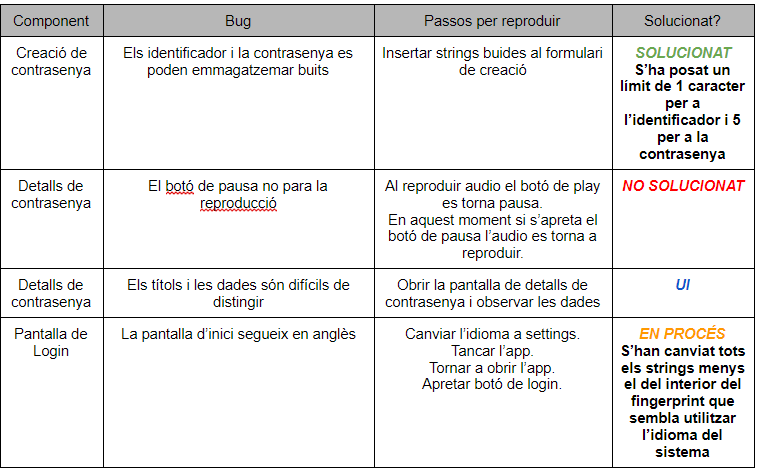

# Index

* [Planification](#Planification)
* [Design](#Design)
* [Testing](#testing)
* [Bug management](#bugs)

# Contrasenyes_segures

App designed to manage passwords using local SQL storage, GOOGLE cloud functions to use TextToSpeech and biometric authentication.

## Planification
Tasks:

Used Trello to manage tasks:

Postman to test http requests:

## Design
Diagram:

Cryptography:
Decided to use the AES algorithm due to the necesity to use the same key to encrypt and to decrypt

## Testing
Junit used to Unit test the cryptography module:
A mock Object for Base64 library was needed.

Exploratory Testing made as follows:

## Bug management
Bugs have been managed using the next structure:

